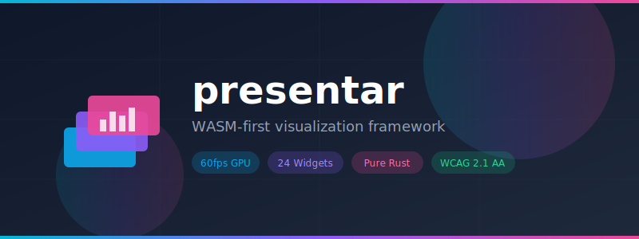

<p align="center">
  
</p>

<h1 align="center">Presentar</h1>

<p align="center">
  <b>WASM-first visualization and rapid application framework for the Sovereign AI Stack.</b>
</p>

<p align="center">
  <a href="https://crates.io/crates/presentar"></a>
  <a href="https://docs.rs/presentar"></a>
  <a href="https://github.com/paiml/presentar/actions/workflows/ci.yml"></a>
  <a href="https://img.shields.io/badge/coverage-88%25-brightgreen"></a>
  <a href="https://opensource.org/licenses/MIT"></a>
</p>

---

## Features

- **WASM-First**: Primary target is `wasm32-unknown-unknown`
- **Zero Dependencies**: Minimal external crates (winit, fontdue only)
- **60fps Rendering**: GPU-accelerated via WebGPU/WGSL shaders
- **Accessibility**: Built-in WCAG 2.1 AA compliance checking
- **Declarative**: YAML-driven application configuration
- **Testable**: Zero-dependency test harness with visual regression

## Installation

Add to your `Cargo.toml`:

```toml
[dependencies]
presentar = "0.1"
presentar-widgets = "0.1"
```

## Quick Start

```rust
use presentar::widgets::{Button, Column, Text};
use presentar::{Constraints, Size, Widget};

// Build UI tree
let ui = Column::new(vec![
    Box::new(Text::new("Hello, Presentar!")),
    Box::new(Button::new("Click me")),
]);

// Measure and layout
let constraints = Constraints::new(0.0, 800.0, 0.0, 600.0);
let size = ui.measure(&constraints);
```

## YAML Configuration

```yaml
app:
  name: "My Dashboard"

widgets:
  root:
    type: Column
    children:
      - type: Text
        value: "Hello World"
      - type: Button
        label: "Click"
```

## Architecture

```
Layer 9: App Runtime        - YAML parser, Pacha integration
Layer 8: Presentar          - Widget tree, layout engine
Layer 7: Trueno-Viz         - GPU primitives, WGSL shaders
Layer 6: Trueno             - SIMD/GPU tensor operations
```

## Testing

```bash
# Run all tests
cargo test

# Run with coverage
cargo llvm-cov

# Run benchmarks
cargo bench -p presentar-core
```

## Documentation

- [Book](book/) - Comprehensive documentation
- [API Docs](https://docs.rs/presentar) - Rustdoc API reference

## License

MIT License - see [LICENSE](LICENSE) for details.

## Contributing

See [CONTRIBUTING.md](CONTRIBUTING.md) for guidelines.
