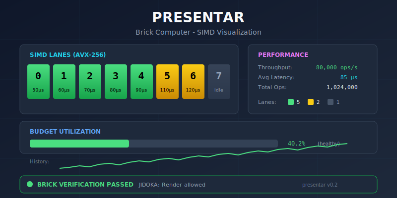

# Presentar

<p align="center">
  <b>WASM-first visualization and rapid application framework for the Sovereign AI Stack.</b>
</p>

<p align="center">
  <a href="https://crates.io/crates/presentar"></a>
  <a href="https://docs.rs/presentar"></a>
  <a href="https://github.com/paiml/presentar/actions/workflows/ci.yml"></a>
  <a href="https://img.shields.io/badge/coverage-95%25-brightgreen"></a>
  <a href="https://opensource.org/licenses/MIT"></a>
</p>

---

Presentar provides a WASM-first UI framework for building high-performance visualization and application components. Built on the Sovereign AI Stack, it enables 60fps GPU-accelerated rendering with zero Python dependencies.

## Table of Contents

- [Features](#features)
- [Installation](#installation)
- [Quick Start](#quick-start)
- [Brick Architecture](#brick-architecture-probar-spec-009)
- [Examples](#examples)
- [YAML Configuration](#yaml-configuration)
- [Widgets](#widgets)
- [Architecture](#architecture)
- [Testing](#testing)
- [Documentation](#documentation)
- [Related Crates](#related-crates)
- [License](#license)
- [Contributing](#contributing)

## Features

- **WASM-First**: Primary target is `wasm32-unknown-unknown`
- **Brick Architecture**: Tests define interface (PROBAR-SPEC-009) - all widgets implement `Brick` trait
- **Zero Dependencies**: Minimal external crates (winit, fontdue only)
- **60fps Rendering**: GPU-accelerated via WebGPU/WGSL shaders
- **JIDOKA Enforcement**: Rendering blocked if Brick verification fails
- **Accessibility**: Built-in WCAG 2.1 AA compliance checking
- **Declarative**: YAML-driven application configuration
- **Testable**: Zero-dependency test harness with visual regression

## Installation

Add to your `Cargo.toml`:

```toml
[dependencies]
presentar = "0.2"
presentar-widgets = "0.2"
```

## Quick Start

```rust
use presentar::widgets::{Button, Column, Text};
use presentar::{Brick, Constraints, Size, Widget};

// Build UI tree - all widgets implement Brick trait
let ui = Column::new(vec![
    Box::new(Text::new("Hello, Presentar!")),
    Box::new(Button::new("Click me")),
]);

// Verify before rendering (PROBAR-SPEC-009: Brick Architecture)
assert!(ui.can_render(), "Widget must pass Brick verification");

// Measure and layout
let constraints = Constraints::new(0.0, 800.0, 0.0, 600.0);
let size = ui.measure(&constraints);
```

## Brick Architecture (PROBAR-SPEC-009)

<p align="center">
  
</p>

All widgets implement the `Brick` trait, enforcing "tests define interface":

```rust
use presentar::{Brick, BrickAssertion, BrickBudget, Widget};

// Every widget has:
// - assertions(): What the widget promises (TextVisible, ContrastRatio, etc.)
// - budget(): Performance budget (default 16ms for 60fps)
// - verify(): Runtime verification of assertions
// - can_render(): Returns false if verification fails

let button = Button::new("Submit");

// Check assertions
println!("Brick: {}", button.brick_name());
println!("Assertions: {:?}", button.assertions());
println!("Can render: {}", button.can_render());

// JIDOKA: Rendering is blocked if can_render() returns false
```

**Key Benefits:**
- Widgets declare their contracts as falsifiable assertions
- Verification happens before rendering, not after bugs ship
- Performance budgets are enforced at the framework level

### SIMD Visualization Demo

The `brick_computer` example demonstrates Brick Architecture with SIMD lane visualization:

```bash
cargo run --example brick_computer -p presentar
```

**Visual Features (trueno-viz polish):**
- 8 SIMD lanes as colored bricks (green=success, yellow=warning, gray=idle)
- True-color ANSI with perceptually distinct status colors
- Unicode box drawing (╭╮╰╯│─) for professional TUI panels
- Block characters (█▓░) for budget utilization meters
- Braille sparklines (⣀⣄⣤⣦⣶⣷⣿⡿) for history visualization
- Real-time throughput, latency, and operation metrics
- JIDOKA verification status: rendering blocked if any brick fails

```
╭─ SIMD LANES (AVX-256) ───────────────────╮╭─ PERFORMANCE ─────────────╮
│ ████  ████  ████  ████  ████  ▓▓▓▓  ▓▓▓▓  ░░░░ ││ Throughput:  80,000 ops/s │
│  0     1     2     3     4     5     6     7   ││ Avg Latency:      85 μs   │
│ 50μs  60μs  70μs  80μs  90μs 110μs 120μs idle ││ Total Ops:   1,024,000    │
╰──────────────────────────────────────────╯╰────────────────────────────╯
╭─ BUDGET UTILIZATION ─────────────────────────────────────────────────╮
│ Frame ████████████████░░░░░░░░░░░░░░░░░░░░  40.2% (healthy)         │
│ History: ⣀⣄⣤⣦⣶⣷⣿⡿⣿⣷⣶⣦⣤⣄⣀⣄⣤⣦⣶⣷⣿⡿⣿⣷⣶⣦⣤⣄⣀⣄⣤⣦⣶⣷⣿⡿⣿⣷⣶⣦⣤         │
╰──────────────────────────────────────────────────────────────────────╯
╭─ BRICK VERIFICATION ─────────────────────────────────────────────────╮
│ ● ALL BRICKS LIT - JIDOKA: Render allowed                            │
╰──────────────────────────────────────────────────────────────────────╯
```

## Examples

Run examples with `cargo run --example <name> -p presentar`:

| Example | Description |
|---------|-------------|
| `brick_computer` | SIMD visualization with bricks lighting up - trueno-viz polish |
| `dashboard` | Full dashboard with charts, metrics, and navigation |
| `cht_sparkline` | Compact sparkline charts for inline metrics |
| `cht_heatmap_basic` | Heatmap visualization |
| `cht_donut` | Donut/pie chart |
| `cht_scatter_bubble` | Scatter plots with bubble sizing |
| `hello_world` | Minimal widget tree example |
| `visual_demo` | Widget gallery demonstrating all components |
| `showcase_shell` | Shell autocomplete demo (WASM) |

**Dashboard Categories:**
- `dsh_*` - Dashboard examples (alerts, infrastructure, performance, pipeline, research)
- `cht_*` - Chart examples (sparkline, heatmap, donut, boxplot, scatter)
- `edg_*` - Edge case testing (a11y, unicode, RTL, high cardinality, memory soak)
- `apr_*` - APR model visualization (architecture, weights, version history)
- `ald_*` - ALD data pipeline (lineage, correlation, batch upload)

## YAML Configuration

```yaml
app:
  name: "My Dashboard"

widgets:
  root:
    type: Column
    children:
      - type: Text
        value: "Hello World"
      - type: Button
        label: "Click"
```

## Showcase Demo: Shell Autocomplete

Real-time shell command autocomplete powered by a trained N-gram model. **Zero infrastructure** - runs entirely in the browser via WASM.

```bash
make serve
# Open http://localhost:8080/shell-autocomplete.html
```

| Metric | Value |
|--------|-------|
| Bundle Size | 574 KB |
| Inference Latency | <1ms |
| Cold Start | <100ms |
| Server Required | None |

**10X faster than Streamlit/Gradio** with zero Python dependencies.

See [docs/specifications/showcase-demo-aprender-shell-apr.md](docs/specifications/showcase-demo-aprender-shell-apr.md) for full specification.

## Widgets

| Widget | Description |
|--------|-------------|
| `Button` | Interactive button with hover/press states |
| `Text` | Text rendering with font configuration |
| `Container` | Layout container with padding/margins |
| `Column` | Vertical flex layout |
| `Row` | Horizontal flex layout |
| `Checkbox` | Toggle checkbox with label |
| `TextInput` | Single-line text input field |
| `Tabs` | Tabbed navigation container |
| `Grid` | CSS Grid-compatible layout |
| `Chart` | Data visualization charts |

## Terminal Widgets (presentar-terminal)

btop/htop-style terminal UI widgets with full Unicode and color support:

| Widget | Description |
|--------|-------------|
| `CpuGrid` | Per-core CPU bars with braille graphs |
| `MemoryBar` | Segmented memory usage (used/cached/available) |
| `ProcessTable` | Sortable process list with selection |
| `NetworkPanel` | Interface bandwidth with sparklines |
| `BrailleGraph` | High-resolution braille charts (2×4 dots/cell) |
| `Sparkline` | Compact trend visualization (8-level) |
| `Heatmap` | 2D data visualization with color gradients |
| `Gauge` | Percentage meters with gradient colors |
| `BoxPlot` | Statistical distribution visualization |
| `Tree` | Hierarchical tree view |
| `Scrollbar` | Vertical/horizontal scrollbars |
| `Border` | Box drawing with multiple styles |

**Features (matching btop/ratatui):**
- Braille symbols (⣿), block characters (█▄), TTY-safe ASCII fallback
- CIELAB perceptual color interpolation for smooth gradients
- 101-step gradient support with LAB color space
- Auto color mode detection (TrueColor → 256 → 16 → Mono)
- Tokyo Night, Dracula, Nord, Monokai themes
- Superscript (⁰¹²³) and subscript (₀₁₂₃) number formatting
- Zero-allocation steady-state rendering

```bash
# Run system dashboard example (cbtop)
cargo run -p presentar-terminal --example system_dashboard
```

## Architecture

```
Layer 9: App Runtime        - YAML parser, Pacha integration
Layer 8: Presentar          - Widget tree, layout engine
Layer 7: Trueno-Viz         - GPU primitives, WGSL shaders
Layer 6: Trueno             - SIMD/GPU tensor operations
```

## Testing

```bash
# Run all tests
cargo test

# Run with coverage
cargo llvm-cov

# Run benchmarks
cargo bench -p presentar-core
```

## Documentation

- [Book](book/) - Comprehensive documentation
- [API Docs](https://docs.rs/presentar) - Rustdoc API reference

## Related Crates

| Crate | Description |
|-------|-------------|
| [`trueno`](https://crates.io/crates/trueno) | SIMD-accelerated tensor operations |
| [`trueno-viz`](https://crates.io/crates/trueno-viz) | GPU rendering primitives |
| [`aprender`](https://crates.io/crates/aprender) | Machine learning algorithms |
| [`presentar-core`](https://crates.io/crates/presentar-core) | Core types and traits |
| [`presentar-widgets`](https://crates.io/crates/presentar-widgets) | Widget library |
| [`presentar-layout`](https://crates.io/crates/presentar-layout) | Layout engine |
| [`presentar-terminal`](https://crates.io/crates/presentar-terminal) | btop-style terminal widgets |

## License

MIT License - see [LICENSE](LICENSE) for details.

## Contributing

See [CONTRIBUTING.md](CONTRIBUTING.md) for guidelines.
